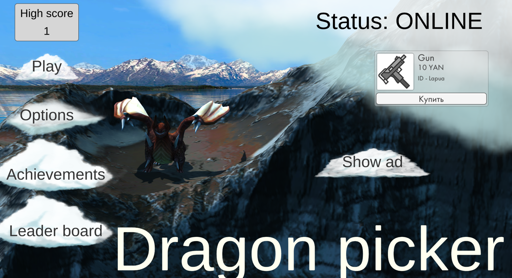

# РАЗРАБОТКА ИГРОВЫХ СЕРВИСОВ
Отчет по лабораторной работе #6 выполнил:
- Назаров Лев Сергеевич
- РИ300012

Отметка о выполнении заданий (заполняется студентом):

| Задание | Выполнение | Баллы |
| ------ | ------ | ------ |
| Задание 1 | * | 60 |
| Задание 2 | * | 20 |
| Задание 3 | * | 20 |

знак "*" - задание выполнено; знак "#" - задание не выполнено;

Работу проверили:
- к.т.н., доцент Денисов Д.В.
- к.э.н., доцент Панов М.А.
- ст. преп., Фадеев В.О.

## Цель работы
Создание интерактивного приложения с рейтинговой системой
пользователя и интеграция игровых сервисов в готовое приложение.

## Задание 1
### Используя видео-материалы практических работ 1-5 повторить реализацию приведенного ниже функционала:
– 1 Практическая работа «Интеграция баннерной рекламы». <br>
– 2 Практическая работа «Интеграция видеорекламы». <br>
– 3 Практическая работа «Показ видеорекламы пользователю за вознаграждение». <br>
– 4 Практическая работа «Создание внутриигрового магазина». <br>
– 5 Практическая работа «Система антиблокировки рекламы». <br>

Ход работы:
#### Работа 1: 
1) Создать RTB-блок в рекламной сети яндекс.
2) Добавить идентификатор блока в поле banner static в настройках проекта Unity.
3) Забилдить проект и залить на яндекс игры.
4) Поставить галочку Static RBT in game в настройках плагина PluginYG.

#### Работа 2: 
1) Добавить в код показ видео рекламы при проигрыше и при входе в игру.
2) Поставить в настройках плагина PluginYG Pause type - All и Pause method - remember previous state. 

#### Работа 3: 
1) Создать скрипт ADReward:
```cs
public class ADReward : MonoBehaviour
{
    private void OnEnable()
    {
        YandexGame.CloseVideoEvent += Rewarded;
    }
    private void OnDisable()
    {
        YandexGame.CloseVideoEvent -= Rewarded;
    }
    void Rewarded(int id)
    {
        if (id == 1)
        {
            Debug.Log("Пользователь получил награду");
        }
        else
        {
            Debug.Log("Пользователь остался без награды");
        }
    }
    public void OpenAD()
    {
        YandexGame.RewVideoShow(Random.Range(0, 2));
    }
}
```
2) Добавить этот скрипт на сцену главного меню.
3) Создать в главном меню кнопку для показа видео с наградой.
4) Ивент по нажатию на кнопку - ADReward.OpenAD.

#### Работа 4: 
1) Добавить в главное меню префаб OnePurchase из префабов плагина.
2) Создать покупку в консоли разработчика яндекс игр.

3) Добавить в инстанс префаба OnePurchase в главном меню ID покупки.

#### Работа 5: 
1) Поставить галочку Check adblock в настройках плагина YG.
## Задание 2
### Добавить в приложение интерфейс для вывода статуса наличия игрока в сети (онлайн или офлайн). 
1) Создать текст в главном меню для отображения статуса игрока.
2) Добавить код для установки статуса.
```cs
private void Start()
{
    SettingsMenu.GetComponent<Settings>().LoadData();
    if (YGManager.IsAuthorized)
    {
        HighScoreText.text = YandexGame.savesData.HighScore.ToString();
        OnlineStatusText.text = "Status: ONLINE";
    }
    else
    {
        YGManager.AuthSuccess += AuthSuccess;
    }
}
private void AuthSuccess()
{
    HighScoreText.text = YandexGame.savesData.HighScore.ToString();
    OnlineStatusText.text = "Status: ONLINE";
}
```

## Задание 3
### Предложить наиболее подходящий на ваш взгляд способ монетизации игры D.Picker. Дать развернутый ответ с комментариями.
1) Скины, косметика. <br>
    Красивые модельки для персонажа/дракона с новыми эффектами/анимациями. <br>
2) Реклама с наградой виде доп. щитов/жизней или внутриигровой валюты. <br>
    Проиграл - можно посмотреть рекламу, чтобы получить один щит, в гл. меню можно посмотреть рекламу чтобы получить внутриигровую валюту. <br>
3) Внутриигровые покупки - улучшения/апгрейды, одноразовые паверапы. <br>
   В гл. меню в магазине покупаешь улучшалки и одноразовые <br>
## Выводы
Научился: <br>
    - Добавлять рекламу <br>
    - Создавать внутриигровые покупки <br>
## Powered by

**BigDigital Team: Denisov | Fadeev | Panov**